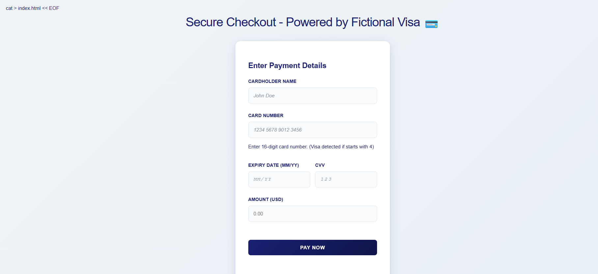
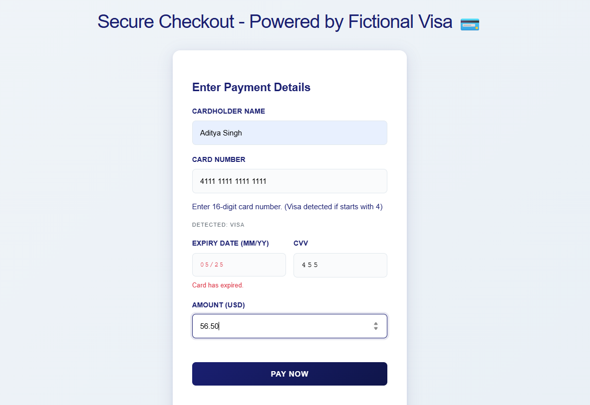
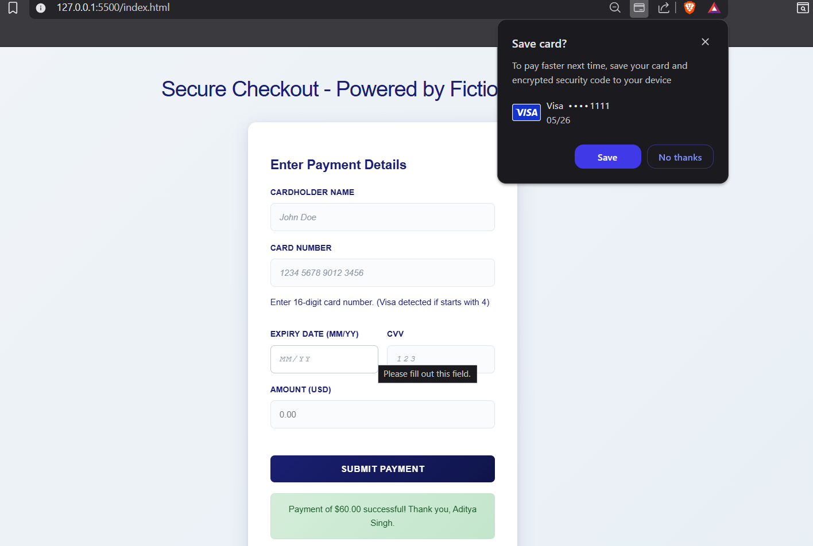

Secure Checkout System
This project is a frontend-only Secure Checkout system that demonstrates client-side validation of Visa card payments. It is intended for educational and demonstration purposes and does not process real transactions.

Project Overview
The checkout form accepts cardholder name, card number, expiry date, and CVV. Client-side validation enforces:

correct card number format for Visa (including Luhn checksum),
expiry date not in the past,
valid CVV format,
non-empty cardholder name.
At present, the implementation is restricted to Visa test cards only.

Features
Responsive, accessible checkout form layout
Client-side card number validation with Luhn algorithm
Expiry date validation (must be a future date)
CVV validation (3 digits for Visa)
Input highlighting and clear error messages for invalid entries

Demo
Here’s a quick look at the project in action:

Checkout Form Screenshot

Validation Example:

Success Example:

Technologies
HTML5 — structure and semantic markup
CSS3 — layout and visual styling
JavaScript (ES6) — validation logic and interactions
Project Structure
checkout-project/
├── index.html        # Main checkout form
├── style.css         # Styling for the form
└── script.js         # Card validation and logic
How to Use
Open index.html in any modern browser.

Enter card details using a Visa test card, for example:

Card Number: 4111 1111 1111 1111
Expiry Date: any future month/year (e.g., 12/28)
CVV: any 3 digits (e.g., 123)
Click the Checkout button to run the client-side validation.

Luhn Algorithm — logic and example
The Luhn algorithm (also known as the "mod 10" algorithm) is a checksum formula used to validate identification numbers such as credit-card numbers. The algorithm is applied to the full card number and determines whether the number is syntactically valid.

Steps (summary):

Starting from the rightmost digit and moving left, double every second digit (i.e., digits in positions 2, 4, 6, ... counting from the right).
If doubling produces a value greater than 9, subtract 9 from that value (equivalently sum the digits of the product).
Sum all the resulting digits (the doubled/transformed digits + the untouched digits).
If the total sum is a multiple of 10 (total mod 10 equals 0), the card number passes the Luhn check.
Example: Why 4111 1111 1111 1111 passes
Card number (spaces added for readability):

4 1 1 1  1 1 1 1  1 1 1 1  1 1 1 1
We apply the Luhn steps. For a 16-digit number, the leftmost digit (position 16 from the right) is doubled. The following table shows the digit-by-digit operation (left → right):

Index (left→right)	Digit	Doubled?	After operation
1	4	Yes	8
2	1	No	1
3	1	Yes	2
4	1	No	1
5	1	Yes	2
6	1	No	1
7	1	Yes	2
8	1	No	1
9	1	Yes	2
10	1	No	1
11	1	Yes	2
12	1	No	1
13	1	Yes	2
14	1	No	1
15	1	Yes	2
16	1	No	1
Now sum the "After operation" column step by step:

8 + 1 = 9
9 + 2 = 11
11 + 1 = 12
12 + 2 = 14
14 + 1 = 15
15 + 2 = 17
17 + 1 = 18
18 + 2 = 20
20 + 1 = 21
21 + 2 = 23
23 + 1 = 24
24 + 2 = 26
26 + 1 = 27
27 + 2 = 29
29 + 1 = 30
Total = 30, and 30 mod 10 = 0. Because the final total is divisible by 10, the number 4111 1111 1111 1111 passes the Luhn check and is considered syntactically valid.

Important note: A truncated number such as 4111 1111 1111 is not a complete card number and will fail validation (either by length checks or by the Luhn checksum). Always use the full-length test number expected by the validator (here, 16 digits for Visa).

Test Card (Visa)
Use the following Visa test number for validation and demonstration:

Card Number: 4111 1111 1111 1111
Expiry: any future date (e.g., 12/28)
CVV: any 3 digits (e.g., 123)
These test numbers are for development and demonstration only; they do not represent real accounts.

Future scope
Add support for additional card networks (MasterCard, American Express, RuPay).
Integrate with server-side processing and a payment gateway for end-to-end transactions.
Improve security (tokenization, CSRF protection, secure storage practices).
Add accessibility improvements and more robust UX for mobile devices.
Disclaimer
This project is a demonstration and should not be used for processing real payments. The validation implemented is for client-side checks only and does not replace the security, fraud detection, and compliance measures required for production payment systems.